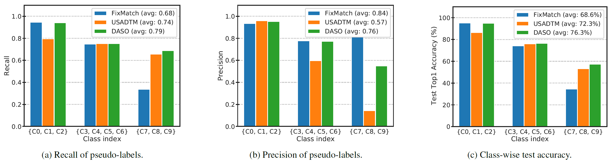

# DASO: Distribution-Aware Semantics-Oriented Pseudo-label for Imbalanced Semi-Supervised Learning.

This repo provides the official pytorch implementation of our paper:

> [DASO: Distribution-Aware Semantics-Oriented Pseudo-label for Imbalanced Semi-Supervised Learning](https://arxiv.org/abs/2106.05682) 
>
> [Youngtaek Oh](https://ytaek-oh.github.io), [Dong-Jin Kim](https://sites.google.com/site/djkimcv/), and [In So Kweon](http://rcv.kaist.ac.kr/index.php?mid=rcv_faculty)
>
> CVPR 2022

[[Paper]](https://arxiv.org/abs/2106.05682)  [[Project Page]](https://ytaek-oh.github.io/daso)  

This includes the experiments on CIFAR-10, CIFAR-100, and STL-10 datasets with varying number of data-points and imbalance ratio in semi-supervised learning.


## Abstract

The capability of the traditional semi-supervised learning (SSL) methods is far from real-world application due to severely biased pseudo-labels caused by (1) class imbalance and (2) class distribution mismatch between labeled and unlabeled data. 

This paper addresses such a relatively under-explored problem. First, we propose a general pseudo-labeling framework that class-adaptively blends the semantic pseudo-label from a similarity-based classifier to the linear one from the linear classifier, after making the observation that both types of pseudo-labels have complementary properties in terms of bias. We further introduce a novel semantic alignment loss to establish balanced feature representation to reduce the biased predictions from the classifier. We term the whole framework as **D**istribution-**A**ware **S**emantics-**O**riented (DASO) Pseudo-label. 

We conduct extensive experiments in a wide range of imbalanced benchmarks: CIFAR10/100-LT, STL10-LT, and large-scale long-tailed Semi-Aves with open-set class, and demonstrate that, the proposed DASO framework reliably improves SSL learners with unlabeled data especially when both (1) class imbalance and (2) distribution mismatch dominate.

<p align='center'>
  
<b>
Figure 2: Analysis on recall and precision of pseudo-labels and the corresponding test accuracy obtained from FixMatch, USADTM, and DASO (Ours). 
</b>


## Installation

The code is tested with:
- CUDA 10.1
- Python 3.6
- PyTorch 1.4.0
- Single Titan Xp GPU (Mem: 12GB) 


To install requirements:

### (Option 1) Install with conda

```setup
#  installing environments via conda
conda create -n daso python=3.6 -y
conda activate daso

# installing required library
conda install pytorch==1.4.0 torchvision==0.5.0 cudatoolkit=10.0 -c pytorch  # pytorch for CUDA 10.0

pip install yacs
pip install future tensorboard

git clone https://github.com/ytaek-oh/daso.git && cd daso
```

### (Option 2) Install with Docker
```setup
git clone https://github.com/ytaek-oh/daso.git && cd daso
bash docker/run_docker.sh  # see Dockfile therein if needed.
```

## Code Structure
- `configs/`: includes all the pre-defined configuration files for each baseline method and our DASO across all the benchmarks. 
- `lib/algorithm/`: includes the implementations of each baseline method.
- `lib/config/`: holds all the configurations that can be manipulated.


## Training
- As note, each dataset is automatically downloaded to `./data/` when you firstly run the training. 

- You may refer to the pre-defined configuration files on `./configs/`, or all the available default parameters are defined in `lib/config/defaults.py`.


To train the model(s) in the paper, run the command as:

```train
python main.py --config-file {PATH_TO_CONFIG_FILE} {OTHER OPTIONS}
```

Example (1):
```train
# run FixMatch + DASO on CIFAR10-LT with \N_1=500, \M_1=4000 and \gamma_l = \gamma_u = 100.
python main.py --config-file configs/cifar10/fixmatch_daso.yaml \
                DATASET.CIFAR10.NUM_LABELED_HEAD 500 DATASET.CIFAR10.NUM_UNLABELED HEAD 4000 \
                # Below is optional, if required
                SEED {SEED} GPU_ID {DEVICE} \
                {OTHER OPTIONS}
```

Example (2): 
```train
# run FixMatch + DASO under CIFAR100-LT with \N_1=150, \gamma_l = \gamma_u = 20.
python main.py --config-file configs/cifar100/fixmatch_daso.yaml \
                DATASET.CIFAR100.IMB_FACTOR_L 20 DATASET.CIFAR100.IMB_FACTOR_UL 20 \
                {OTHER OPTIONS}
```

Example (3): 
```train
# run FixMatch + DASO under STL10-LT with \N_1=150, \gamma_l = 20.
python main.py --config-file configs/stl10/fixmatch_daso.yaml \
                DATASET.STL10.NUM_LABELED_HEAD 150 DATASET.STL10.IMB_FACTOR_L 20 \
                {OTHER OPTIONS}
```


A commonly used template for the commands would be:
```train
python main.py --config-file configs/{DATASET}/{ALGORITHM}.yaml \
        DATASET.{DATASET}.NUM_LABELED_HEAD {VALUE} DATASET.{DATASET}.NUM_UNLABELED_HEAD {VALUE} \
        DATASET.{DATASET}.IMB_FACTOR_L {VALUE} DATASET.{DATASET}.IMB_FACTOR_UL {VALUE} \
        (ALGORITHM.{ALGORITHM}.{OPTIONS} {VALUE} ...)
```

- For data-specific setups and hyper-parameters in detail, please refer to the `Implementation Details` section in Appendix of our paper. 


## Monitoring Performance
- Final configuration file, checkpoints, and all the logged results and metrics with tensorboard are produced in the path {OUTPUT_DIR} designated in the config file.


## Citation
If you find our work useful for your research, please cite with the following bibtex:
```bibtex
@inproceedings{oh2021distribution,
  title = {DASO: Distribution-aware semantics-oriented pseudo-label for imbalanced semi-supervised learning},
  author = {Oh, Youngtaek and Kim, Dong-Jin and Kweon, In So},
  booktitle = {{IEEE} Conference on Computer Vision and Pattern Recognition (CVPR)},
  year = {2022},
  pages = {9786-9796}
}
```
